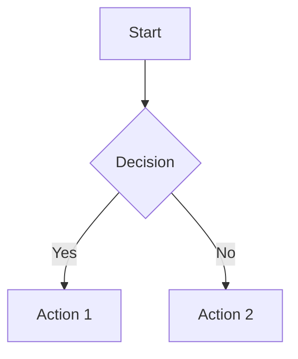
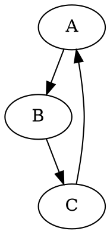

# Markdown Renderer

Convert Markdown files to beautiful HTML with embedded or external SVG diagrams.

## Quick Start

### Basic Rendering
```bash
# Basic rendering
python3 scripts/md_render.py input.md

# Custom output
python3 scripts/md_render.py input.md -o output.html

# Inline SVG (single file)
python3 scripts/md_render.py input.md --inline-svg

# Dark theme
python3 scripts/md_render.py input.md --theme dark
```

### Enhanced Rendering (Magazine Themes + Interactive)
```bash
# Use magazine-style themes (5 options)
python3 scripts/md_render_enhanced.py input.md --theme indigo

# List available themes
python3 scripts/md_render_enhanced.py --list-themes

# With sidebar TOC + reading progress
python3 scripts/md_render_enhanced.py input.md --theme forest

# Disable TOC
python3 scripts/md_render_enhanced.py input.md --no-toc
```

**Enhanced features:**
- 📚 **5 Magazine Themes**: Monocle (墨水经典), Indigo (靛蓝瓷), Forest (森林墨), Kraft (牛皮纸), Dune (沙丘)
- 📖 **Sidebar TOC**: Auto-generated, sticky, with active state tracking
- 📊 **Reading Progress Bar**: Top of page
- 📋 **Copy Code Buttons**: Hover on code blocks
- 🎨 **Serif Headings + Sans Body**: Typography hierarchy
- 📱 **Responsive**: Mobile-friendly
- 🖨️ **Print-Ready**: Clean print CSS


## Features

### Markdown Support
- **GitHub-flavored markdown**: Tables, task lists, strikethrough
- **Syntax highlighting**: Code blocks with Pygments
- **Auto-linking**: URLs and email addresses
- **Smart lists**: Proper nesting and numbering

### Diagram Rendering
- **Mermaid**: Flowcharts, sequence diagrams, class diagrams
- **Graphviz (dot)**: Directed graphs, state machines
- **SVG output**: Vector graphics, scalable
- **Inline or external**: Choose embedding or separate files

### Output Options
- **Standalone HTML**: Self-contained, no external dependencies
- **Responsive**: Mobile-friendly viewport
- **Themes**: Light (default) or dark mode
- **Clean CSS**: GitHub-style formatting

## Diagram Support

### Mermaid

````markdown

````

**Supports:**
- Flowcharts (`graph`)
- Sequence diagrams (`sequenceDiagram`)
- Class diagrams (`classDiagram`)
- State diagrams (`stateDiagram`)
- Gantt charts (`gantt`)
- Pie charts (`pie`)

### Graphviz

````markdown

````

**Supports:**
- Directed graphs (`digraph`)
- Undirected graphs (`graph`)
- DOT language syntax
- Custom node/edge attributes

## Dependencies

### Required
```bash
pip install markdown
```

### Optional (for diagrams)
```bash
# Mermaid CLI
npm install -g @mermaid-js/mermaid-cli

# Graphviz
brew install graphviz           # macOS
apt-get install graphviz        # Ubuntu/Debian
choco install graphviz          # Windows
```

### Optional (for syntax highlighting)
```bash
pip install pygments
```

## Examples

### Example 1: Technical Documentation

```bash
python3 scripts/md_render.py README.md -o docs/index.html
```

Use case: Convert project README to standalone HTML documentation.

### Example 2: Architecture Diagrams

```bash
python3 scripts/md_render.py architecture.md --inline-svg --theme dark
```

Use case: Single-file architecture doc with embedded diagrams.

### Example 3: Batch Processing

```bash
for f in docs/*.md; do
    python3 scripts/md_render.py "$f" -o "html/$(basename "$f" .md).html"
done
```

Use case: Convert entire docs folder to HTML.

## Output Structure

**With external SVG:**
```
output.html
diagram_mermaid_1.svg
diagram_graphviz_1.svg
```

**With inline SVG:**
```
output.html  (all SVG embedded)
```

## Workflow

1. **Write markdown** with code blocks for diagrams
2. **Run renderer** with desired options
3. **Open HTML** in browser or serve statically

## Tips

- **Diagram debugging**: If diagram fails to render, it falls back to code block
- **Performance**: Inline SVG = larger HTML, faster loading (no HTTP requests)
- **External SVG**: Smaller HTML, can reuse SVG files, easier to edit
- **Theme matching**: Use `--theme dark` for dark mode documentation sites

## Limitations

- Mermaid/Graphviz must be installed separately for diagram support
- Diagrams render at build time (not interactive)
- No live preview (static HTML output only)

## Common Use Cases

| Use Case | Command |
|----------|---------|
| Quick preview | `python3 scripts/md_render.py doc.md` |
| Single-file output | `python3 scripts/md_render.py doc.md --inline-svg` |
| Dark theme | `python3 scripts/md_render.py doc.md --theme dark` |
| Documentation site | Batch process all .md files |
| Email-ready HTML | `--inline-svg` for portability |

## See Also

- `examples/demo.md` - Full feature demo
- GitHub-flavored Markdown spec: https://github.github.com/gfm/
- Mermaid docs: https://mermaid.js.org/
- Graphviz docs: https://graphviz.org/
