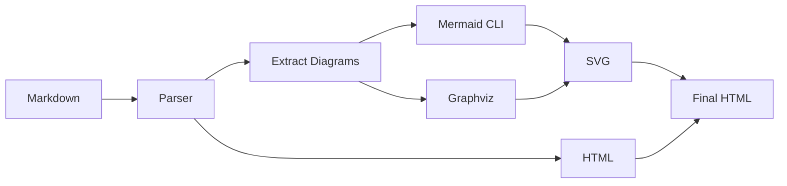
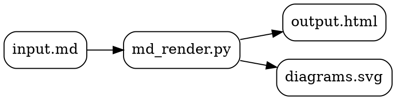

# Markdown Renderer Example

This document demonstrates **markdown → HTML + SVG** rendering.

## Features

- [x] GitHub-flavored markdown
- [x] Syntax highlighting
- [x] Mermaid diagrams → SVG
- [x] Graphviz → SVG
- [x] Tables
- [x] Code blocks

---

## Code Example

```python
def hello(name: str) -> str:
    """Greet someone."""
    return f"Hello, {name}!"

print(hello("World"))
```

## Mermaid Diagram



## Graphviz Flowchart



## Table Example

| Tool | Purpose | Output |
|------|---------|--------|
| Mermaid | Diagrams | SVG |
| Graphviz | Graphs | SVG |
| Pygments | Syntax | HTML |

## Blockquote

> **Note:** This renderer supports both inline SVG (embedded in HTML) and external SVG files.
> Use `--inline-svg` flag for single-file output.

## Lists

**Dependencies:**
1. Python 3.10+
2. `markdown` library
3. `pygments` (optional, for syntax highlighting)
4. `mermaid-cli` (optional, for mermaid diagrams)
5. `graphviz` (optional, for dot diagrams)

**Installation:**
- `pip install markdown pygments`
- `npm install -g @mermaid-js/mermaid-cli`
- `brew install graphviz` (macOS)

---

*Generated with md-renderer skill*
