# Markdown Rendering Reference

## Supported Markdown Syntax

### Headers
```markdown
# H1
## H2
### H3
```

### Emphasis
```markdown
**bold**
*italic*
~~strikethrough~~
```

### Lists
```markdown
- Unordered list
- Item 2

1. Ordered list
2. Item 2

- [x] Task list
- [ ] Incomplete
```

### Links & Images
```markdown
[Link text](https://example.com)

```

### Code
```markdown
Inline `code`

```python
def hello():
    print("Hello")
```
```

### Tables
```markdown
| Header 1 | Header 2 |
|----------|----------|
| Cell 1   | Cell 2   |
```

### Blockquotes
```markdown
> Quote text
> Multiple lines
```

---

## Mermaid Diagram Types

### Flowchart
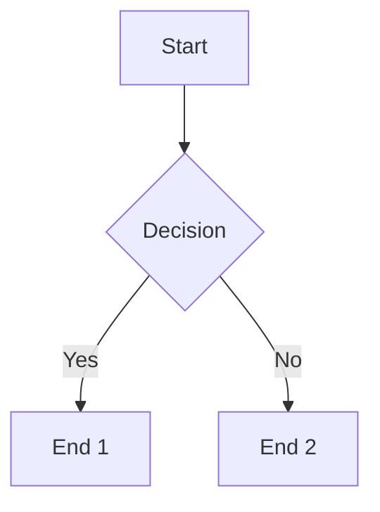

**Direction:**
- `TD` (top-down)
- `LR` (left-right)
- `BT` (bottom-top)
- `RL` (right-left)

**Node shapes:**
- `[Rectangle]`
- `(Rounded)`
- `{Diamond}`
- `([Stadium])`
- `[[Subroutine]]`
- `[(Database)]`

### Sequence Diagram
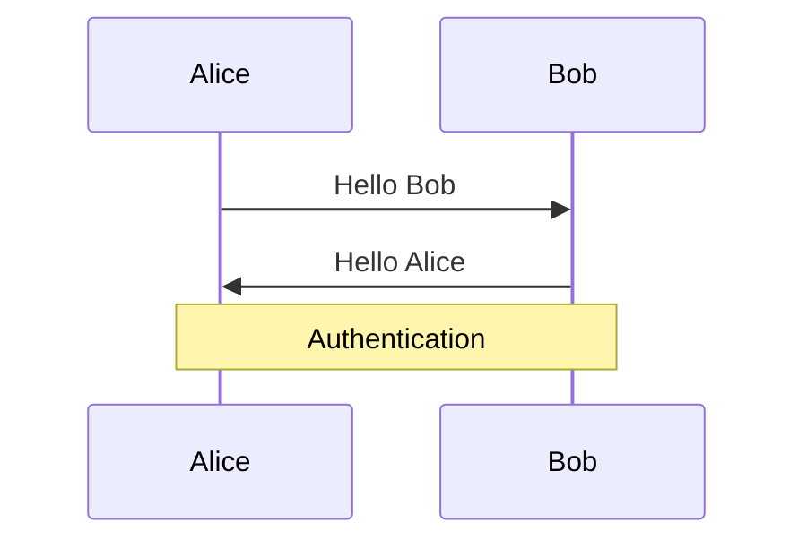

### Class Diagram
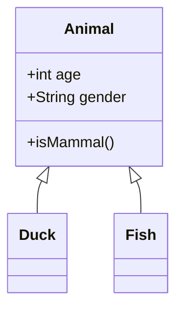

### State Diagram
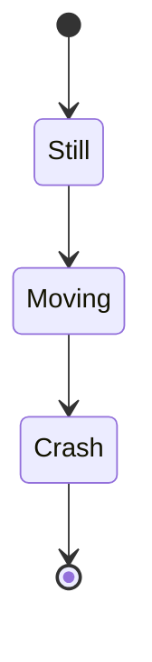

### Gantt Chart
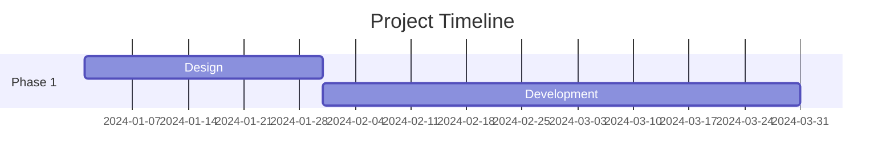

### Pie Chart
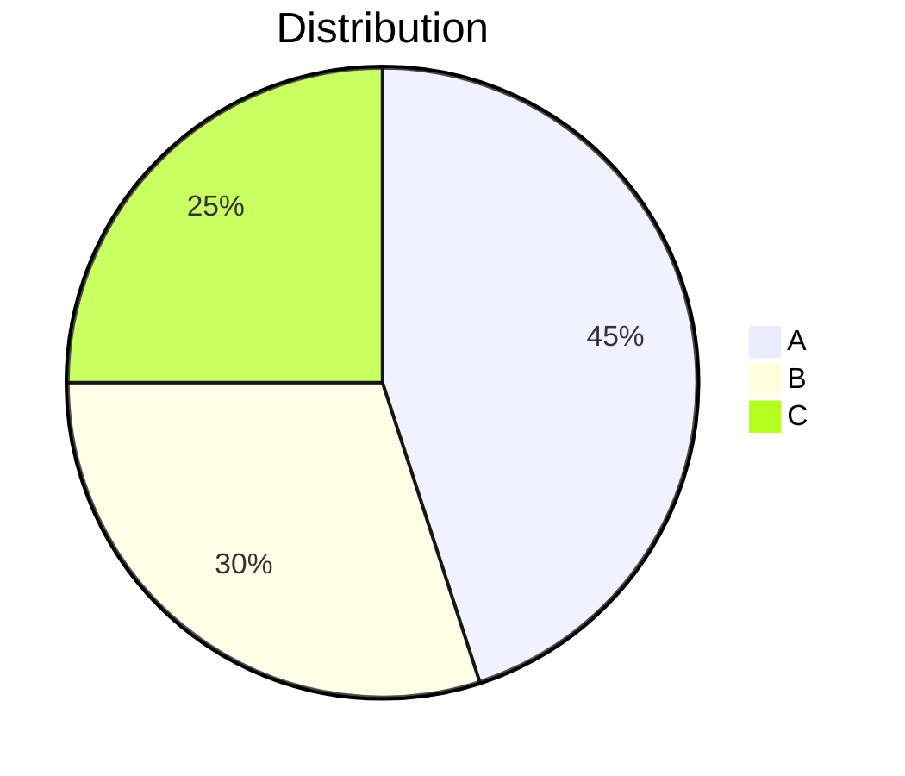

---

## Graphviz (DOT) Reference

### Basic Directed Graph
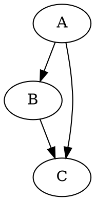

### Undirected Graph
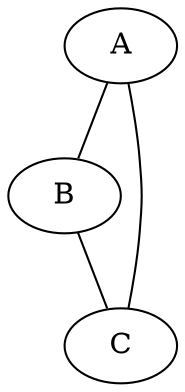

### Node Attributes
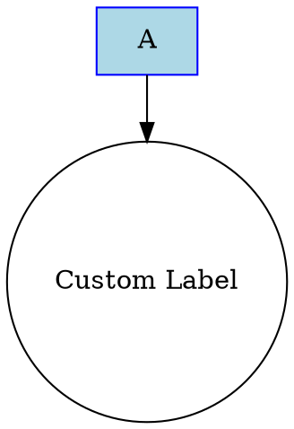

**Common shapes:**
- `box`, `circle`, `ellipse`, `diamond`
- `polygon`, `triangle`, `star`
- `record`, `Mrecord`

### Edge Attributes
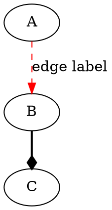

### Subgraphs (Clusters)
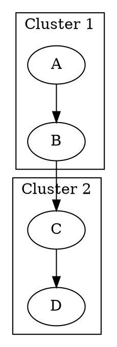

### Rank Direction
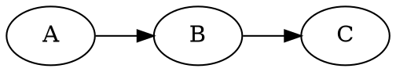

---

## Syntax Highlighting

Supported via Pygments (if installed).

**Example languages:**
- `python`, `javascript`, `typescript`
- `bash`, `shell`, `zsh`
- `java`, `c`, `cpp`, `rust`, `go`
- `html`, `css`, `json`, `yaml`, `toml`
- `sql`, `markdown`, `diff`

**Full list:** https://pygments.org/languages/

---

## Rendering Pipeline

```
input.md
    ↓
1. Extract diagram code blocks (```mermaid, ```dot)
    ↓
2. Render diagrams to SVG
    ↓
3. Replace code blocks with  or inline SVG
    ↓
4. Convert markdown to HTML (python-markdown)
    ↓
5. Inject CSS (theme-based)
    ↓
output.html + *.svg (if external)
```

---

## Theme Customization

### Light Theme (Default)
- Background: `#ffffff`
- Foreground: `#24292e`
- Code background: `#f6f8fa`
- Border: `#e1e4e8`

### Dark Theme
- Background: `#1e1e1e`
- Foreground: `#d4d4d4`
- Code background: `#2d2d2d`
- Border: `#444444`

**Custom theme:**
Modify `get_css_theme()` in `md_render.py`.

---

## Troubleshooting

### Diagrams not rendering
1. Check if `mmdc` (mermaid-cli) or `dot` (graphviz) installed
2. Verify code block language tag: ` ```mermaid ` or ` ```dot `
3. Syntax errors in diagram code → falls back to code block

### Syntax highlighting missing
- Install: `pip install pygments`
- Verify code block has language tag: ` ```python `

### HTML looks broken
- Check CSS theme setting
- Verify markdown extensions loaded correctly
- Try `--inline-svg` to debug external SVG issues

---

## Performance Tips

1. **Inline SVG** (`--inline-svg`):
   - Pros: Single file, no HTTP requests
   - Cons: Larger HTML, slower editing

2. **External SVG**:
   - Pros: Smaller HTML, reusable SVG
   - Cons: Multiple files, relative path dependencies

3. **Batch rendering**:
   - Use shell loop for multiple files
   - Cache compiled markdown extensions (future optimization)

4. **Large diagrams**:
   - Split into multiple smaller diagrams
   - Use graphviz `rankdir` to control layout
   - Simplify mermaid flowcharts
